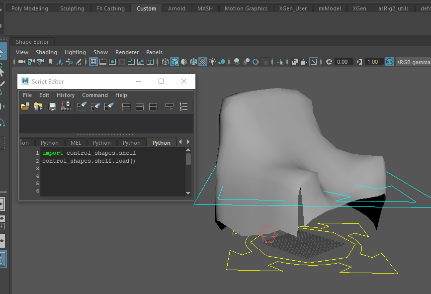

#Control Shapes
*Author: Tim Coleman - tim.coleman.3d@gmail.com*
___
###Description
This Maya python module is for the creation and editing of animation control curves used in rigs.

###Installation

1. Copy the control_shapes module folder to a location in your Maya script path, for example: `C:/Users/username/maya/scripts`

2. Launch Maya. 

3. Set the current shelf you'd like to add the "Control Shapes Tool" button to.

4. In the Script Editor, run the following Python commands:
	#
        import control_shapes.shelf
        control_shapes.shelf.load()

5. You will be prompted to confirm that this is the shelf you want to add the  "Control Shapes Tool" button to.  Confirm by hitting the "Yes" button.

###Usage Example

___
###Credit:
Author: 
Tim Coleman - tim.coleman.3d@gmail.com

*I'd like to give credit to vshotarov and his blog post https://bindpose.com/creating-maya-control-shape-manager/ which was the impetus of this tool.  This incarnation is a hybrid of some of my previous anim curve control tools and vshotarov's "control-shape-manager".*